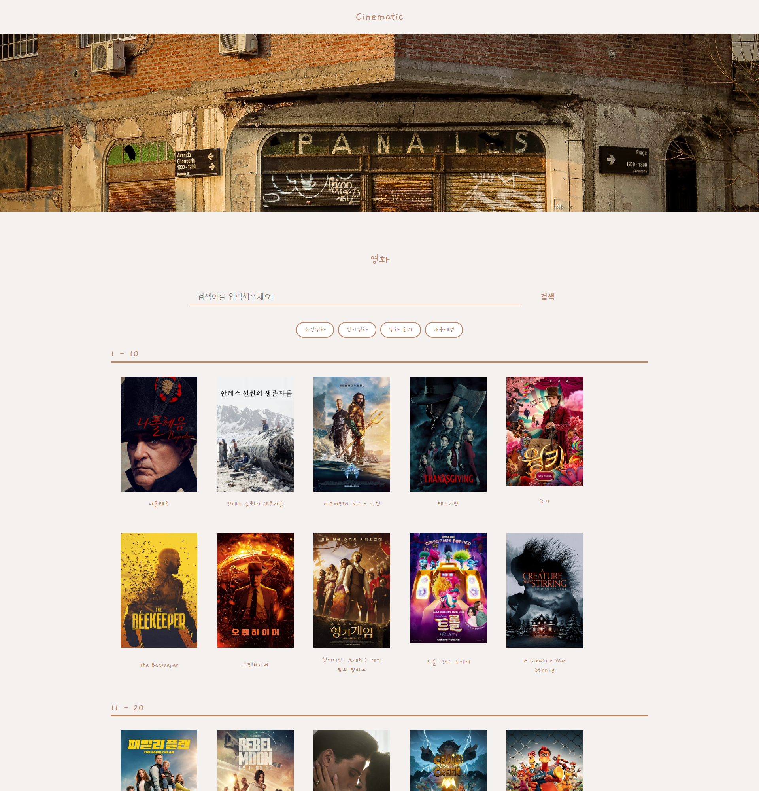
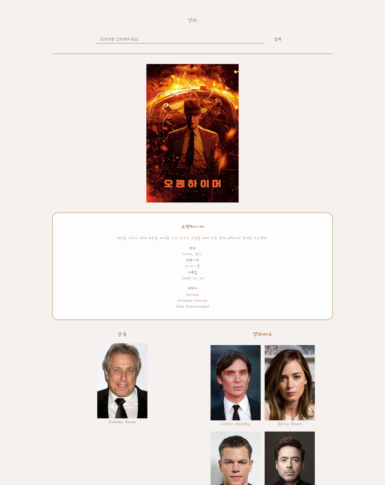
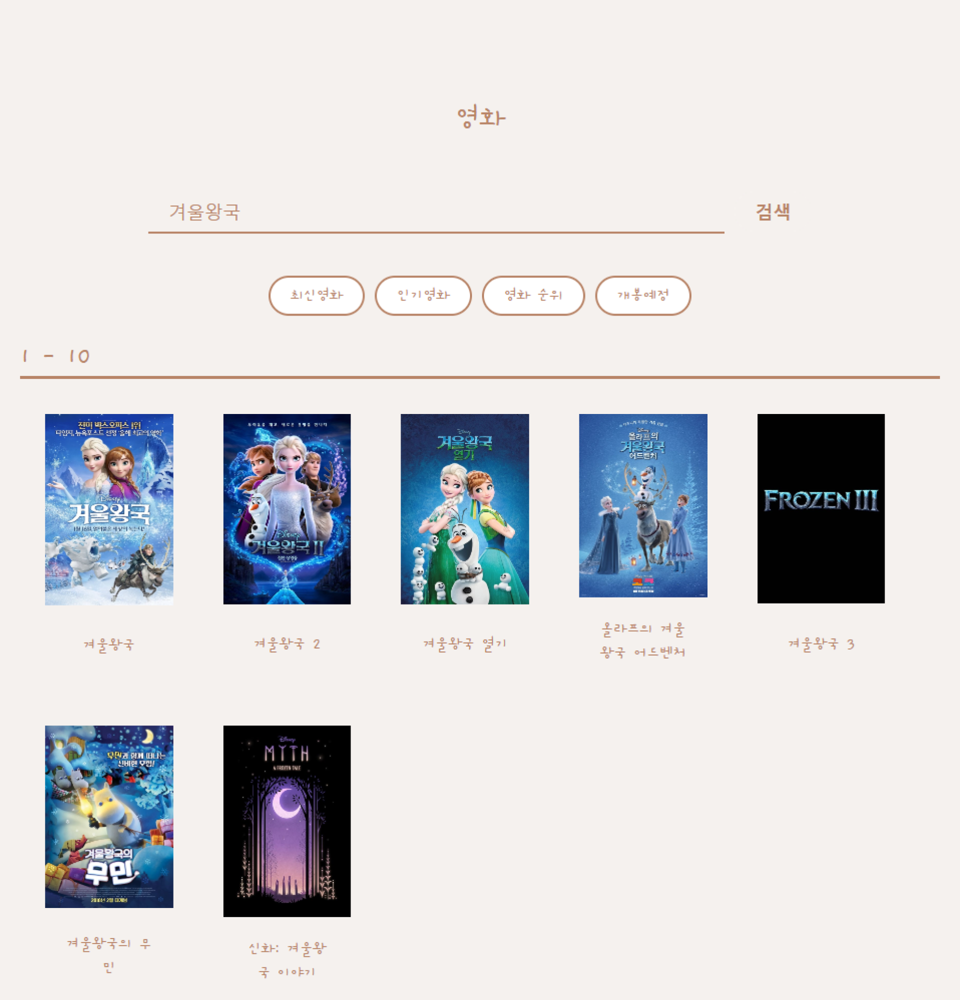

개발기간: 23/11/23 ~ 12/2

### 사이트바로가기: https://cinematic-vue.vercel.app/(사이트 라우팅 오류 존재)

## 기능

1. 최신 영화, 인기 영화 순위 확인
2. 영화 검색을 통해 영화 정보 제공

## 기능 구현

1. 영화 순위

2. 영화 상세 설명

3. 영화 검색

## 사용 툴

개발: VS Code

## 사용 스택

client: HTML/SCSS/Vue.js

API: TMDB API

배포: 미정

## install
`npm install vue`
`npm create vue`
